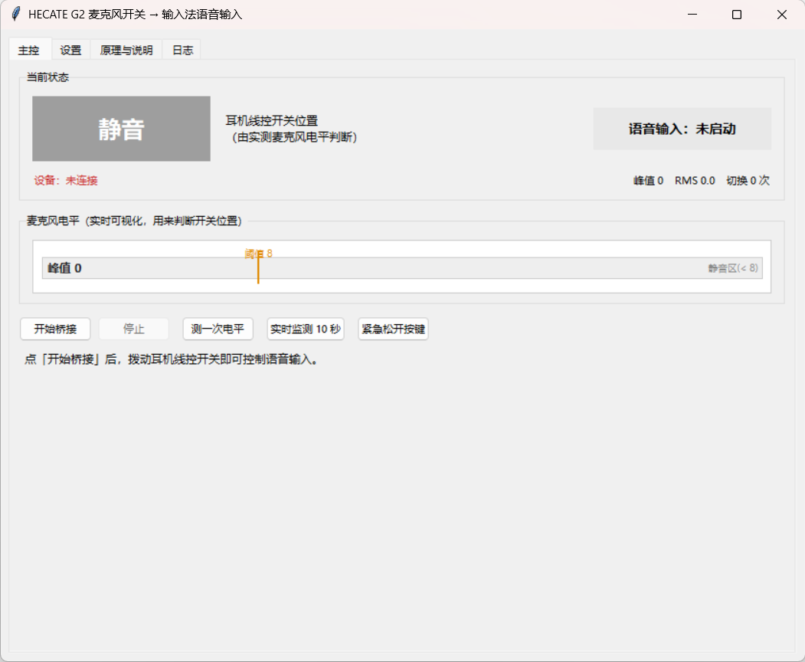

# HECATE G2 语音开关

> 把漫步者 HECATE G2 耳机线控上的「麦克风开关」，变成微信输入法「语音输入」的开关。
> 拨到「麦克风开」自动开始语音输入，拨到「静音」自动停止。


[](https://github.com/MadmanJohnny/hecate-g2-mic-switch/releases/latest)
[](https://gitee.com/madjohnny/hecate-g2-mic-switch)

> **仓库地址**
> GitHub: <https://github.com/MadmanJohnny/hecate-g2-mic-switch>
> Gitee（国内镜像，下载更快）: <https://gitee.com/madjohnny/hecate-g2-mic-switch>



---

## 这是什么

HECATE G2 的线控上有个麦克风开关。它会给 Windows 发 HID 报告，但 Windows 自己
**什么都不做** —— 官方驱动也只是把静音做在耳机芯片内部。于是这个开关平时几乎是废的。

本项目把它接管过来：

| 你做的事 | 发生的事 |
|---|---|
| 把开关拨到「麦克风开」 | 程序替你按住 `Ctrl+Win` → 微信输入法开始语音输入 |
| 把开关拨到「静音」 | 程序松开 `Ctrl+Win` → 语音输入停止 |

免安装、不需要管理员权限、不改注册表。界面里带实时电平表和原理解释。

---

## 两分钟上手

### 方式一：直接用打包好的 exe（推荐）

| 平台 | 下载 |
|---|---|
| GitHub Releases | <https://github.com/MadmanJohnny/hecate-g2-mic-switch/releases/latest> |
| Gitee Releases（国内更快） | <https://gitee.com/madjohnny/hecate-g2-mic-switch/releases> |

下载 `HECATE-G2-VoiceSwitch.exe`（约 13 MB，单文件），双击运行，点「开始桥接」，完事。

> 想开机自动生效：切到「设置」页，勾选「开机自动启动本程序」和
> 「程序启动后自动开始桥接」，保存即可。

### 方式二：从源码运行

只需要 Python 3.8+，**没有任何第三方依赖**（界面用的 tkinter 是标准库自带的）。

```bash
git clone https://github.com/MadmanJohnny/hecate-g2-mic-switch.git
# 国内推荐用镜像：git clone https://gitee.com/madjohnny/hecate-g2-mic-switch.git
cd hecate-g2-mic-switch

python src/bridge_gui.py          # 图形界面
# 或
python src/g2_voice_bridge.py     # 命令行版，Ctrl+C 退出
```

Windows 用户也可以直接双击 `scripts\启动桥接.cmd`。

---

## 它是怎么判断开关在哪一边的

这是整个项目最绕、也最关键的一点。

**❌ 不能用那帧 HID 报告判断。**
拨动开关时耳机发来的是：

```
00 08 00 00 00    ← 按键按下
00 00 00 00 00    ← 按键松开
```

每一次物理拨动都产生**一模一样的一对**，拨到哪一边没有任何区别，
报告里也没有其它字段（其余字节恒为 0，Feature 报告长度为 0）。
它本质上是个"点一下"的瞬时事件，就像键盘按键 —— 你没法靠"按下/松开"
知道 CapsLock 现在亮不亮。

早期版本就是栽在这里：只能统计"拨了几次"，一旦在程序没监听时拨过开关
（比如拔插耳机），开和关就会永久反过来。

**✅ 改用实测麦克风电平判断。**
耳机在静音时是**真的在硬件上切断了话筒信号**：

| 开关位置 | 峰值 | RMS |
|---|---|---|
| 静音 | **1**（完全死寂） | 0.5 |
| 麦克风开（环境安静） | 200 – 300 | 45 – 55 |
| 麦克风开（正常说话） | 600 – 7400 | 80 – 340 |

判定阈值取 8，两侧相差 25 倍以上。于是开关位置是**量出来的**而不是数出来的：

```
拨动开关
   ↓ 一帧 HID 报告（只当"触发器"）
采集 150ms 麦克风信号，量峰值
   ├─ 峰值 ≤ 阈值 → 开关在「静音」  → 松开快捷键，停止语音输入
   └─ 峰值 > 阈值 → 开关在「麦克风开」→ 按住快捷键，开始语音输入
```

好处：拔插耳机、漏事件、一次拨动产生两个事件，都**不会**造成开/关反向。

> 完整的实测过程（HID 报告抓包、Core Audio 静音状态验证、
> 微信输入法长按/单击判定等）见 [docs/原理与实测.md](docs/原理与实测.md)。

---

## 适用条件（换耳机前先看这个）

本工具依赖一个硬件特性：**耳机静音时会切断话筒信号**。
HECATE G2 具备该特性，但**不是所有耳机都有**。

换耳机 / 换电脑后用两个命令自查：

```bash
"HECATE-G2-VoiceSwitch.exe" --list     # 列出所有消费类(0x0C) HID 设备
"HECATE-G2-VoiceSwitch.exe" --probe    # 连测三次麦克风电平
```

`--probe` 的正确输出应该长这样（两边数值差距巨大）：

```
阈值：峰值 ≤ 8 判为「静音」
第 1 次：峰值=1      RMS=0.5     非零=554    → 静音（无信号）
第 2 次：峰值=237    RMS=48.2    非零=7890   → 麦克风开（有信号）
```

拨动开关后再测一次，如果两边数值都差不多（比如都是几百），
说明这款耳机的"静音"不是硬件切断信号，本工具不适用。

界面版没有控制台，上面两个命令的结果会以弹窗显示，并写入
`%APPDATA%\HecateG2VoiceBridge\cli_output.txt`。
设备选择、阈值调整都在「设置」页里。

---

## 配置

图形界面「设置」页可改全部参数；也可以直接编辑配置文件
（打包版在 `%APPDATA%\HecateG2VoiceBridge\g2_bridge_config.json`）：

| 键 | 默认值 | 说明 |
|---|---|---|
| `vid_pid` | `VID_2D99&PID_0026` | 耳机的 USB VID/PID |
| `hid_path` | `""` | 指定具体 HID 接口，留空则按 `vid_pid` 自动找 |
| `capture_device` | `""` | 录音设备名关键字，留空用系统默认设备 |
| `hotkey` | `ctrl+win` | 语音输入快捷键（微信输入法 Windows 版为长按它） |
| `mute_peak_threshold` | `8` | 峰值 ≤ 此值判为「静音」 |
| `probe_ms` | `150` | 每次判定采集多长音频 |
| `settle_ms` | `60` | 拨动后等多久再采集 |
| `debounce_ms` | `400` | 去抖窗口 |
| `start_dictating` | `false` | 启动时若麦克风是开的，是否立刻开始录音 |
| `autostart_bridge` | `false` | 程序启动后自动开始桥接 |

快捷键写法：`ctrl` / `alt` / `shift` / `win` / `A-Z` / `F1-F12` 等用 `+` 连接，
例如 `ctrl+alt+space`。

---

## 常见问题

**Q：语音输入期间键盘变得怪怪的？**
这是"长按说话"的固有代价。微信输入法 Windows 版要求真的按住 `Ctrl+Win`，
所以这段时间里敲键盘会带上 Win 修饰键（比如按空格会切换输入法）。
说话时别敲键盘，说完拨回静音即可。

**Q：键盘像被 Win 键卡住了？**
正常退出会自动松开。若用任务管理器强杀进程或断电，按键可能残留。
界面版点「紧急松开按键」；命令行跑 `scripts\紧急松开按键.cmd`；
或者手动按一下左 `Ctrl` 和左 `Win` 键，各按一次。

**Q：拔插耳机后需要重新设置吗？**
不需要。程序每 2 秒自动重连，且重新根据实测电平判断开关位置，不会错位。

**Q：能同时开两个吗？**
不能，也不需要。程序用命名互斥体做了单实例保护，第二个实例会直接退出。

**Q：支持别的语音输入方式吗？**
把 `hotkey` 改成对应快捷键即可，程序只负责"按住/松开"这一个动作。

**Q：支持 macOS / Linux 吗？**
不支持。HID 读取、`SendInput`、`waveIn` 都用的 Win32 API。

---

## 项目结构

```
.
├── src/                        主程序
│   ├── bridge_core.py          核心：HID 监听 + 麦克风电平判定 + 按键注入
│   ├── bridge_gui.py           图形界面（tkinter）
│   ├── g2_voice_bridge.py      命令行版
│   ├── mic_level.py            麦克风电平表（诊断）
│   └── release_keys.py         强制松开按键
├── scripts/                    给最终用户的快捷方式
│   ├── 启动桥接.cmd
│   ├── 调试运行.cmd
│   ├── 紧急松开按键.cmd
│   ├── 安装开机自启.cmd / 卸载开机自启.cmd
│   └── autostart.ps1
├── tools/                      诊断工具
│   ├── hid_probe.py            HID 能力查看 / 报告抓取 / 描述符解析
│   ├── diag_test.py            HID 事件时间线 + 麦克风电平对照
│   ├── mute_probe.ps1          Core Audio 静音状态监视
│   └── key_combo_test.py       组合键注入测试
├── docs/
│   ├── 原理与实测.md            完整的实测过程与结论
│   ├── 排错.md
│   ├── 使用说明.txt             给最终用户的简易说明（可随 exe 分发）
│   └── images/
└── build_exe.cmd               一键打包 exe
```

---

## 开发与打包

环境：Windows 10/11 + Python 3.8+（运行时零第三方依赖）。

```bash
# 图形界面自检（不开窗口，检查 tkinter / 设备枚举 / 麦克风采集）
python src/bridge_gui.py --selftest

# 命令行排查
python src/g2_voice_bridge.py --list
python src/g2_voice_bridge.py --probe

# 打包成单文件 exe（自动建 venv 并装 PyInstaller）
build_exe.cmd
```

打包产物在 `dist/HECATE-G2-VoiceSwitch.exe`。

---

## 免责声明

本项目为个人自用工具，与漫步者（Edifier / HECATE）、腾讯（微信输入法）
均无任何关联，未获得其授权或背书。

程序通过 `SendInput` 模拟键盘按键，理论上可能被部分软件的安全策略拦截；
请在遵守相关软件使用条款的前提下自行决定是否使用。使用风险自负。

## 许可证

[MIT](LICENSE)

---

## English

A small Windows utility that turns the hardware microphone-mute switch on the
Edifier HECATE G2 gaming headset into a push-to-talk trigger for WeChat Input
Method's voice typing.

The switch only emits an undirected "button click" HID report, so the program
determines the switch position by **measuring the capture signal**: when muted,
the headset cuts the microphone signal in hardware (peak ≈ 1), otherwise the
noise floor is far above the threshold. This makes the mapping immune to
unplug/replug and missed events.

No third-party dependencies. Prebuilt single-file exe available in
[Releases](https://github.com/MadmanJohnny/hecate-g2-mic-switch/releases/latest)
(also mirrored on [Gitee](https://gitee.com/madjohnny/hecate-g2-mic-switch)).
Windows only. Licensed under MIT.
